# Backtest your first strategy
1. On the home page, you will see a Create button on the top-right of the page.
    

    
See screenshots

    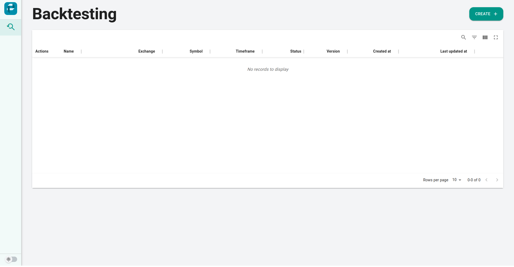
    

2. After clicking the button, it will navigate you to the backtest strategy page. Now, you can fill in details about your first strategy.
    - **Strategy name**: Name of your strategy
    - **Exchange**: Currently support only Binance exchange
    - **Symbol**: Trading pair of crypto that you want to apply your strategy. Currently provide a list of all SPOT symbols from Binance.
    - **Timeframe**: Timeframe of kline (candlestick). Your strategy will be triggered at the end of each kline in the specified period.
    - **Maximum number of klines per execution**: Most indicators require previous values to calculate the current value. For example, SMA-100 requires at least 100 previous values for calculating an accurate current value. 
    This means that you should set this value based on the indicators you use. The system will try to get and provide as much data as possible to you. However, the number of provided klines may be less than the maximum setting, in case of the backtesting period is longer than the available data. 
    Setting this value too high can slow down execution and take up unnecessary disk and memory resources.
    - **Backtest period**: Period of backtesting
    

    
See screenshots

    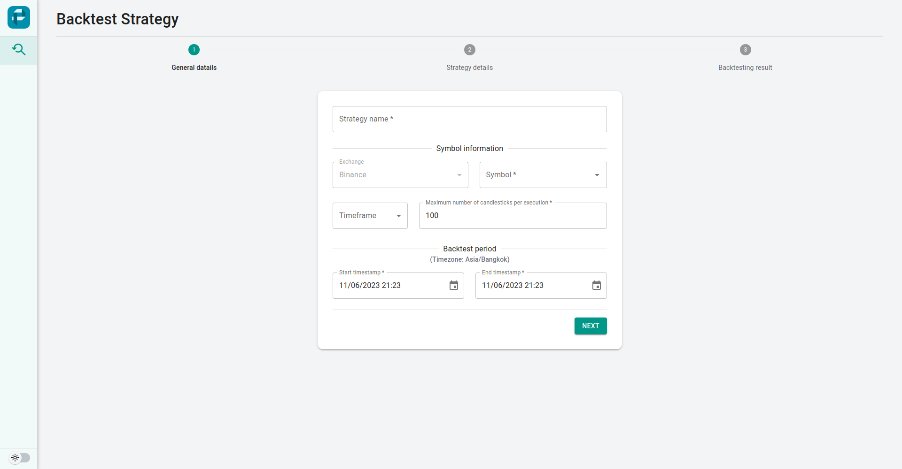
    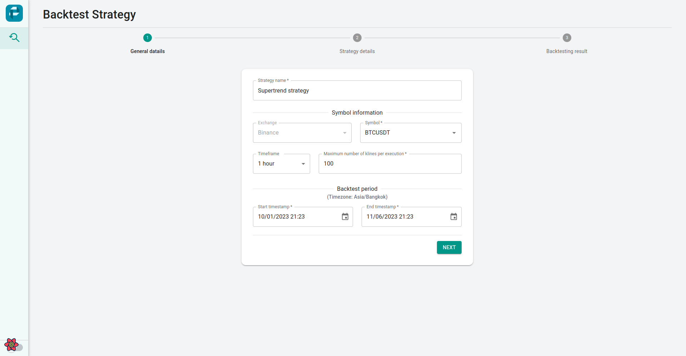
    

3. When you click the Next button, it may take a few seconds to download klines data. 
4. Then, you can configure a few more values.
    - **Capital currency**: You can choose between base and quote assets of the selected symbol to be your capital currency.
    - **Initial capital**: Value of the initial capital
    - **Taker fee rate**: Fee rate for taker order. It can be vary based on your exchange and account tier.
    - **Maker fee rate**: Fee rate for taker order. It can be vary based on your exchange and account tier.
    

    
See screenshots

    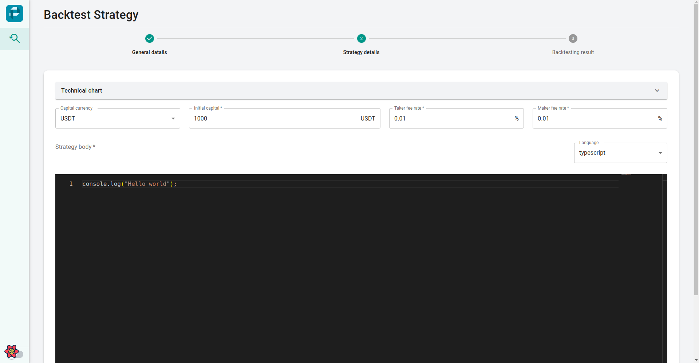
    

5. If you expand the Technical chart panel, it will show you all the data in the backtesting period (+ data before that based on the maximum number of klines setting) in an interactive chart. At this point, you can play around <u>by adding indicators and configuring them</u> until you figure out the strategy that you are looking for.
   

    
See screenshots

    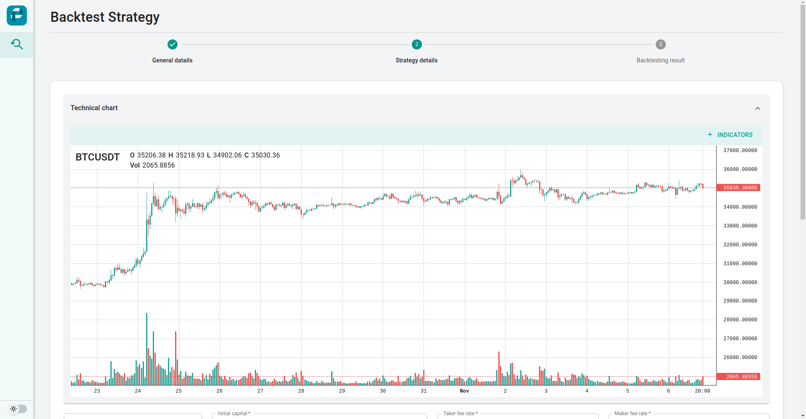
    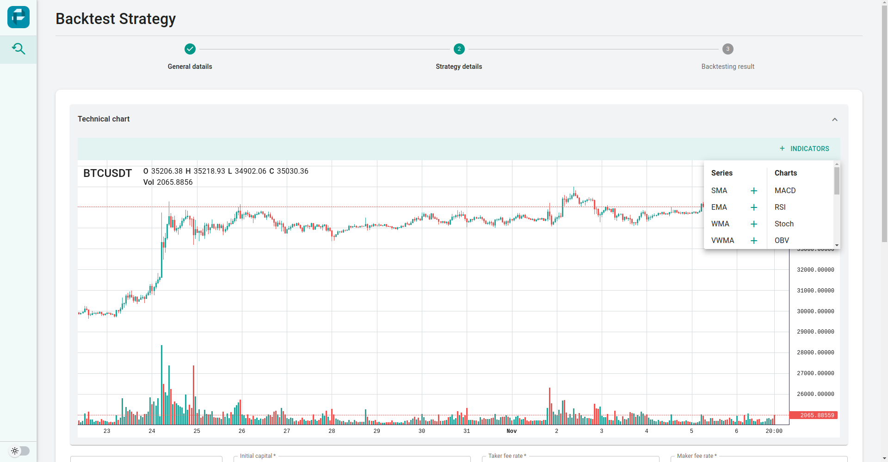
    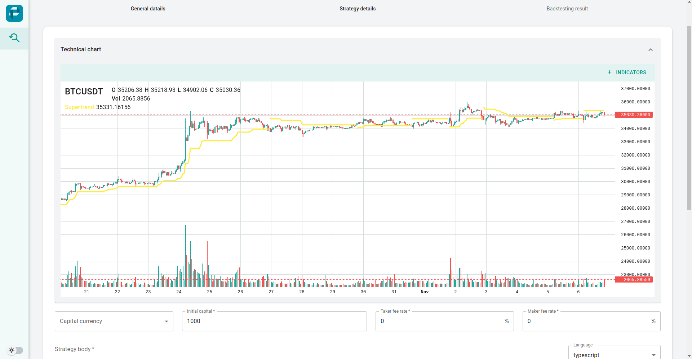
    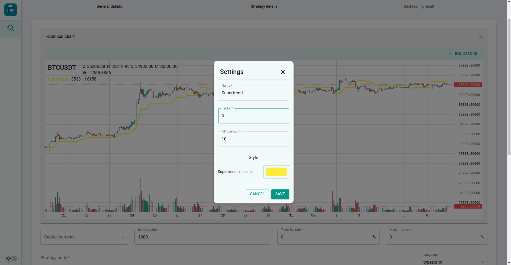
    

6. To make your strategy executable, you will write a strategy in the code editor at the bottom. This editor also provides syntax validation and auto-complete that make your life easier.
    

    
See screenshots

    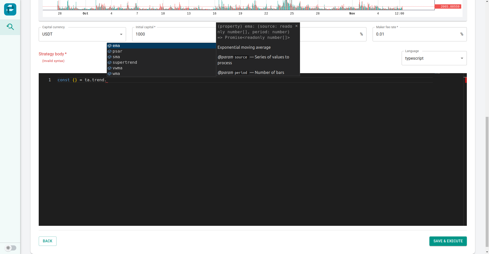
    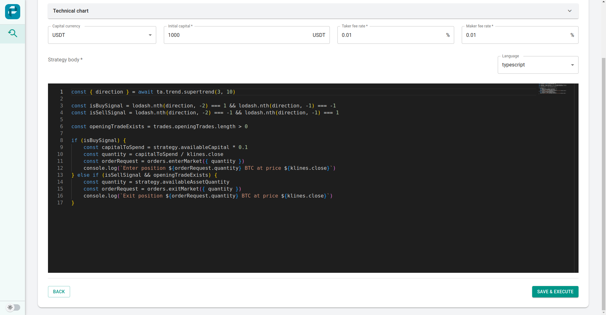
    

7. Let's check the result. Click Save & Execute button, then wait.
   

    
See screenshots

    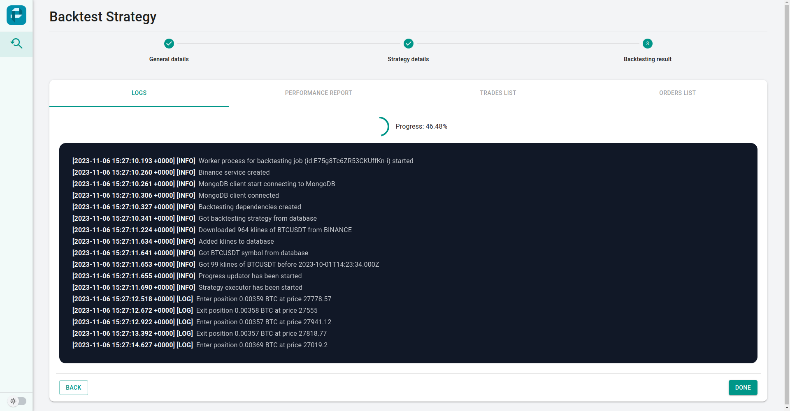
    

8. You can use Console module to debug your strategy. Those logs will be shown in the Logs panel.
   

    
See screenshots

    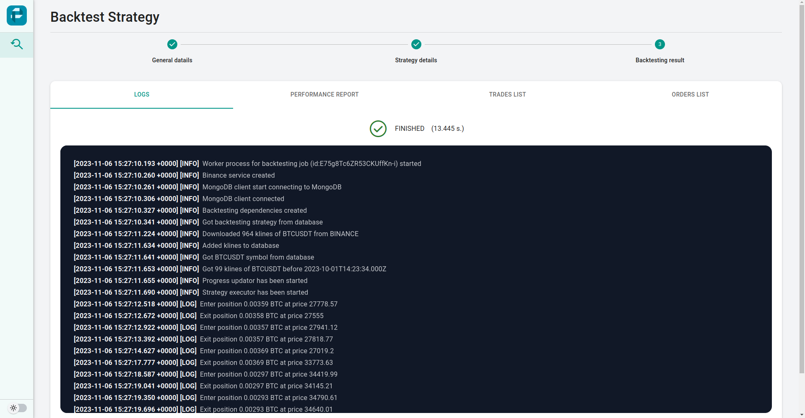
    

9. You can check your strategy performance in the Performance panel.
   

    
See screenshots

    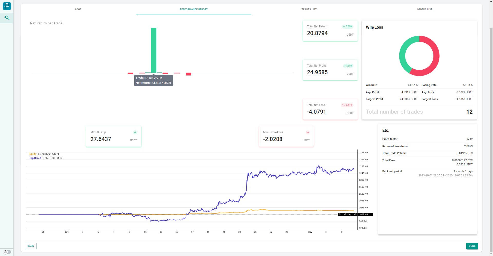
    

10. You can see the trades list of your strategy in detail in the Trades panel.
    

    
See screenshots

    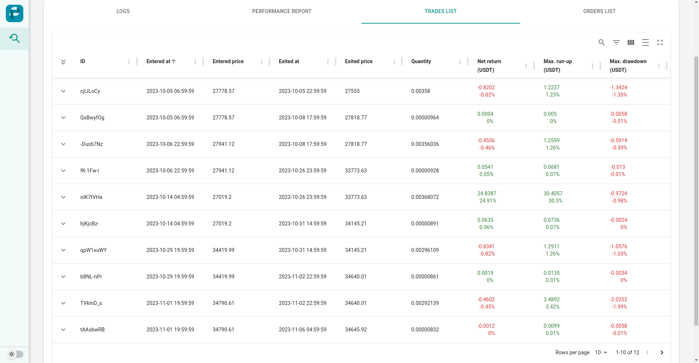
    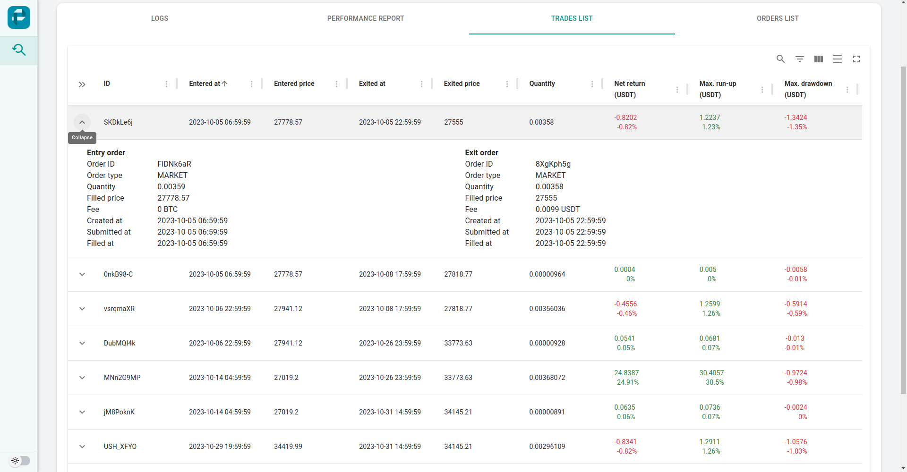
    

11. You can see the orders list of your strategy in detail in the Orders panel. It also virtualizes order events on a chart so you can easily see when the event happened.
    

    
See screenshots

    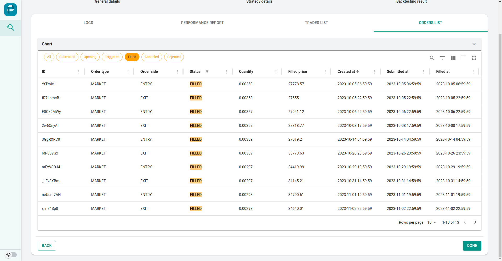
    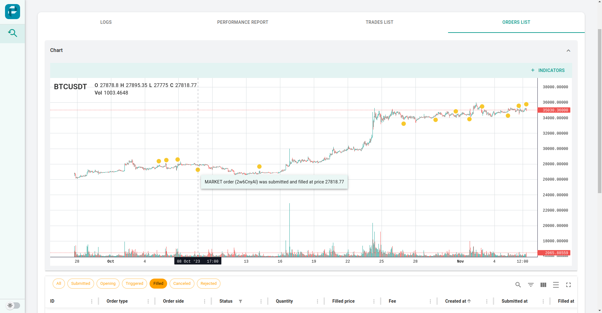
    

12. If you go back to the home page, you will see the strategy you just created in the table. You can come back to review the execution result or modify the strategy later.
    

    
See screenshots

    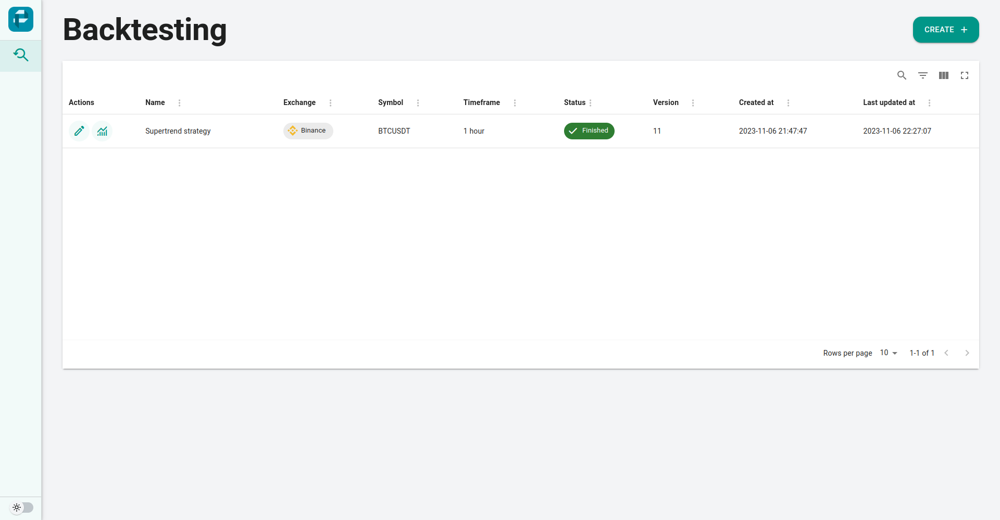
    
